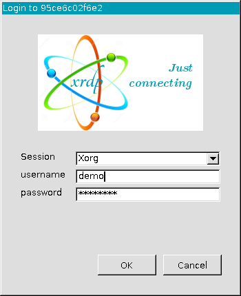
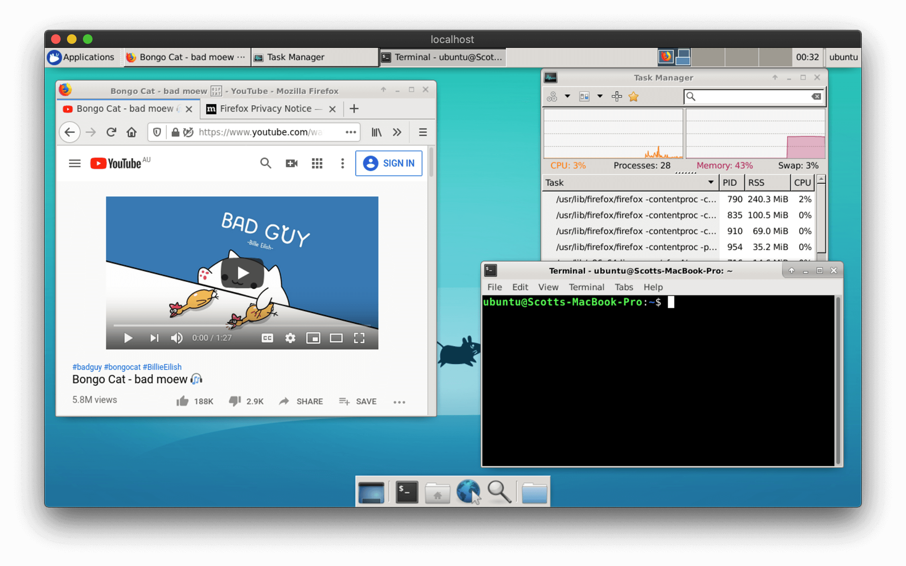

# ubuntu-docker-desktop-xrdp

[](https://github.com/scottyhardy/docker-remote-desktop/actions/workflows/build.yml)

Docker container for RDP client based on Ubuntu 24.10 LTS with [XFCE](https://xfce.org) with a Windows like look.
This project is forked from the parent [docker-remote-desktop](https://github.com/scottyhardy/docker-remote-desktop) project.

## Build local docker image, run container and open RDP client:

All necessary instructions are prepared by functions of the [init.sh](init.sh) bash script.

```bash
. init.sh # Load functions
dbuild    # Build docker image
drun      # Run container
dxrdp     # Open xfreerdp desktop client
dstop     # Stop container
```

To log in, use the following default user account details:

```bash
Username: demo
Password: changeit
```

## Screenshot of login prompt of `xfreerdp` application



## Screenshot of XFCE desktop



